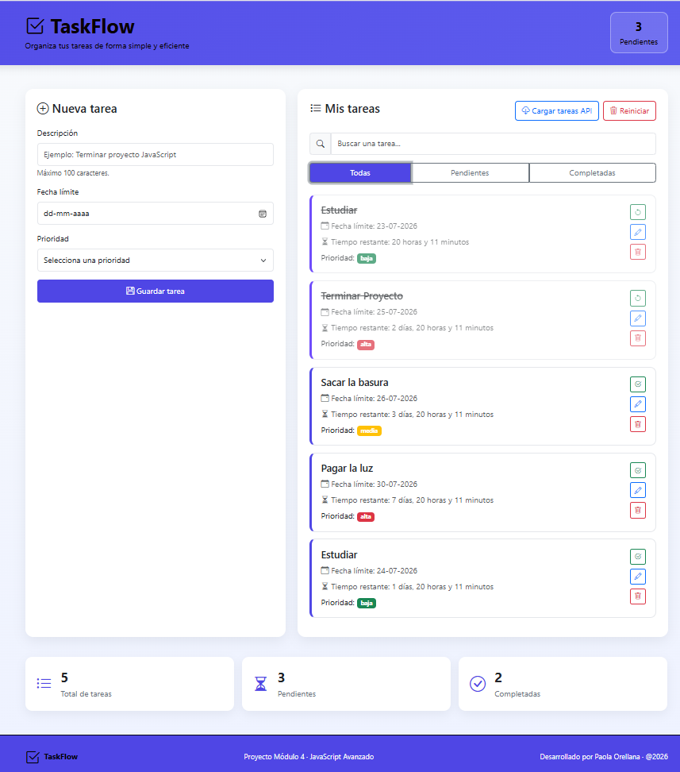

# ✅ TaskFlow

Aplicación web para la gestión de tareas desarrollada como proyecto final del **Módulo 4 - JavaScript Avanzado**.

TaskFlow permite crear, editar, completar, eliminar y administrar tareas de forma sencilla, incorporando conceptos modernos de JavaScript como Programación Orientada a Objetos, consumo de APIs, almacenamiento local y manipulación dinámica del DOM.

---
Visita el demo operativo en el siguiente enlace:
[Demo operativo](https://paolaorellanal.github.io/TaskFlow/)

---

# 🚀 Funcionalidades

- ✅ Crear tareas
- ✏️ Editar tareas
- 🗑️ Eliminar tareas
- ✔️ Marcar tareas como completadas
- 🔄 Cambiar estado de una tarea
- 🔍 Buscar tareas en tiempo real
- 📂 Filtrar tareas (Todas, Pendientes y Completadas)
- 📅 Fecha límite
- ⏳ Cálculo automático del tiempo restante
- 🚫 Validación de fechas
- 🚫 Validación de tareas duplicadas
- 📊 Contadores de tareas
- 💾 Persistencia mediante LocalStorage
- 🌐 Carga de tareas desde una API externa
- 🔄 Reiniciar la aplicación
- 📱 Diseño Responsive

---

# 🛠 Tecnologías utilizadas

- HTML5
- CSS3
- Bootstrap 5
- Bootstrap Icons
- JavaScript ES6+
- LocalStorage
- Fetch API
- JSONPlaceholder API

---

# 📚 Conceptos de JavaScript aplicados

El proyecto incorpora los principales contenidos del módulo:

- Programación Orientada a Objetos (POO)
- Clases
- Objetos
- Arrays
- Métodos
- Eventos del DOM
- Manipulación dinámica del DOM
- Arrow Functions
- Template Literals
- Destructuring
- Async / Await
- Fetch API
- Try / Catch
- setTimeout()
- setInterval()
- LocalStorage

---

# 📂 Estructura del proyecto

```
TASKFLOW
│
├── assets
│   ├── css
│   │   └── estilos.css
│   │
│   └── js
│       ├── api.js
│       ├── app.js
│       ├── gestorTareas.js
│       └── tarea.js
│
├── docs
│   └── Caption-Principal.png
│
├── index.html
└── README.md
```

---

# ▶️ Instalación

1. Clonar el repositorio

```bash
git clone https://github.com/TU_USUARIO/TaskFlow.git
```

2. Abrir la carpeta del proyecto.

3. Ejecutar el proyecto utilizando **Live Server** desde Visual Studio Code.

---

# 🌎 API utilizada

Se utiliza la API pública:

https://jsonplaceholder.typicode.com/

para obtener tareas de ejemplo mediante **Fetch API**.

---

# 💡 Características destacadas

- Persistencia de datos mediante LocalStorage.
- Diseño responsive utilizando Bootstrap.
- Arquitectura basada en Programación Orientada a Objetos.
- Gestión dinámica del DOM sin recargar la página.
- Validaciones de formularios.
- Simulación de procesos asíncronos mediante `setTimeout()`.
- Actualización automática del tiempo restante con `setInterval()`.

---

# 👩‍💻 Autora

**Paola Orellana**

Ingeniera Informática especializada en Seguridad de la Información y Ciberseguridad.

---

# 📄 Licencia

Proyecto desarrollado con fines educativos para el Bootcamp de Desarrollo Web.

---

# 📎 Anexo

## Vista principal

La siguiente imagen muestra la interfaz principal de la aplicación **TaskFlow**, donde se puede visualizar el formulario para la creación de tareas, el listado de tareas registradas, los filtros disponibles y el resumen de la aplicación.


